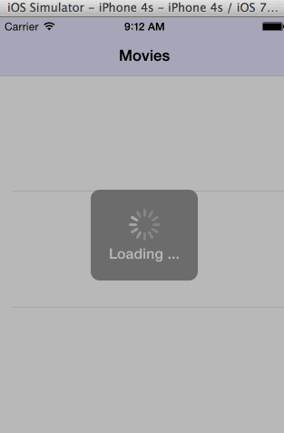

MyFlix

# Rotten Tomatoes 

This is an iphone application for displaying the top rentals using the [RottenTomatoes API](http://www.rottentomatoes.com/). See the [RottenTomatoes Networking Tutorial](http://guides.thecodepath.com/android/RottenTomatoes-Networking-Tutorial) on our cliffnotes for a step-by-step tutorial.

Time spent: 12 hours spent in total

Completed user stories:

 * [x] User can view a list of movies from Rotten Tomatoes. Poster images are loaded asynchronously.
 * [x] User can view movie details by tapping on a cell
 * [x] User sees loading state while waiting for movies API. using AFNetworking
 * [x] User sees error message when there's a networking error. using MBProgressHUD
 * [x] User can pull to refresh the movie list.
 * [ ] All images fade in (optional)
 * [x] For the large poster, load the low-res image first, switch to high-res when complete (optional)
 * [ ] All images should be cached in memory and disk. In other words, images load immediately upon cold start (optional).
 * [ ] Customize the highlight and selection effect of the cell. (optional)
 * [x] Customize the navigation bar. (optional)
 * [ ] Add a tab bar for Box Office and DVD. (optional)
 * [ ] Add a search bar. (optional)
 
 Additional Requirements
 * [x] Must use Cocoapods.
 * [ ] Asynchronous image downloading must be implemented using the UIImageView category in the AFNetworking library.
 
Notes: 

Walkthrough of all user stories:

